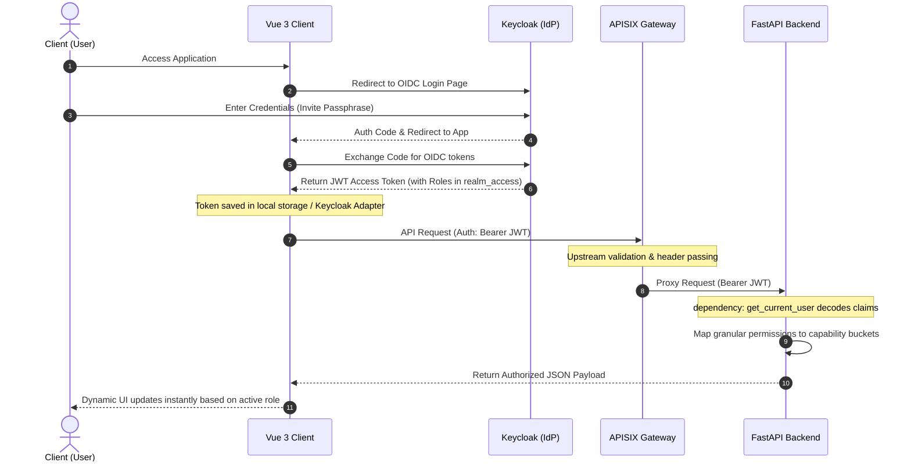

# SchoolDesk Keycloak Integration & Multi-Role RBAC Workflow Guide

This document explains the unified authentication, authorization, and permission checking workflow for the SchoolDesk platform. It details how the **Vue 3 Frontend**, **APISIX API Gateway**, **FastAPI Backend**, and **Keycloak Identity Provider** integrate to support dynamic, multi-role RBAC.

---

## 1. Authentication & Authorization Workflow

The following diagram illustrates how authentication claims propagate through the microservices infrastructure when a user logs in:



### Flow Breakdown:
1. **OIDC Redirect**: The Vue 3 client detects a login request and redirects the user to Keycloak.
2. **Keycloak Group resolution**: Upon successful authentication, Keycloak inspects the groups the user belongs to (e.g., `/teachers`). It compiles all roles mapped to those groups.
3. **JWT Injection**: Keycloak packages the roles into the `realm_access.roles` OIDC token claim list.
4. **Token Verification**: 
   * On the **Backend**, FastAPI's `get_current_user` dependency decodes the OIDC JWT token without database queries, checks permissions dynamically, and parses active claims.
   * On the **Frontend**, the Vue 3 Pinia store extracts the role list and handles client-side security policies.

---

## 2. Dynamic RBAC Translation Logic

To maintain clean code, both backend and frontend use a **Capability Mapping Decoupler**. Developers write clean code checking for high-level capabilities (like `teacher` or `school_admin`), while the auth layers translate them to granular permissions:

### ⚙️ Permissions-to-Role Mapping Matrix

| High-Level Role Capability | Granular Role Permissions | Mapped Functions in Code |
|-----------------------------|---------------------------|--------------------------|
| **`school_admin`** | `school:write`, `school:read`, `user:create`, `user:delete`, `user:link` | Manage school structure, register staff, link child. |
| **`teacher`** | `teacher:write`, `teacher:read`, `event:create`, `event:edit`, `event:delete`, `event:propose`, `event:clone`, `resource:create`, `enrollment:teacher_approve` | Log attendance, create events, plan resources, approve enrollments. |
| **`manager`** | `event:review`, `event:publish`, `event:view_draft`, `resource:price`, `billing:invoice`, `billing:pay`, `billing:refund`, `billing:audit` | Approve event drafts, set final pricing, audit student logs. |
| **`parent`** | `enrollment:parent_approve`, `billing:pay` | Approve child requests, pay trip invoices. |
| **`student`** | `enrollment:request` | Browse published trips, request enrollment. |

*Note: The `super_admin` role (and the granular permission `system:write`) automatically bypasses all access validations and grants full control.*

---

## 3. Step-by-Step Keycloak Integration Guide

To configure Keycloak to integrate with the SchoolDesk codebase, complete the following configuration steps:

### Step A: Define Realm Roles
1. Open the Keycloak Admin Console.
2. Navigate to **Realm Roles** under the *Configuration* menu.
3. Click **Create Role** and create the granular permission roles used by the code (e.g. `school:write`, `event:create`, `enrollment:teacher_approve`, `billing:pay`).

### Step B: Create Groups & Map Roles
1. Navigate to **Groups** in Keycloak sidebar.
2. Click **Create Group** and create your 9 main organizational groups (e.g., `/teachers`, `/parents`, `/students`, `/school_admins`).
3. Click on the group name, select **Role Mapping** tab, and assign the appropriate granular permissions:
   * E.g., for the **Teachers** group, assign: `school:read`, `event:create`, `event:edit`, `event:delete`, `event:propose`, `event:clone`, `teacher:write`, `teacher:read`, `enrollment:teacher_approve`, `enrollment:view_roster`.

### Step C: Configure OIDC Client Mappers
Ensure that all group-inherited roles are mapped into the access token payload:
1. Go to **Client Scopes** ➔ select **roles** scope.
2. Under the **Mappers** tab ➔ select the **realm roles** mapper.
3. Ensure both **Add to ID token** and **Add to access token** are toggled **On**.
4. *(Optional)* If you want to mapper group names directly, click **Configure new mapper** ➔ select **Group Membership** mapper ➔ name it `groups` and set **Token Claim Name** to `groups`.

### Step D: Bind Users
1. Go to **Users** ➔ Select or create a user profile.
2. Navigate to the **Groups** tab.
3. Assign the user to their respective Groups (e.g. adding a teacher to the `/teachers` group). Keycloak will automatically inherit all roles mapped to that group.

---

## 4. How the Code Resolves Permissions

### Backend (`dependencies.py` and `service.py`)
FastAPI checks if a user holds permissions dynamically. When an endpoint specifies `CurrentUser.has_role("teacher")`, the backend executes:
```python
    def has_role(self, role_name: str) -> bool:
        roles_set = set(self.roles)
        # 1. Super admin bypass
        if "super_admin" in roles_set or self.role == "super_admin" or "system:write" in roles_set:
            return True
        # 2. Direct match
        if role_name in roles_set or self.role == role_name:
            return True
        # 3. Dynamic mappings intersection
        if role_name in mappings:
            return bool(roles_set & mappings[role_name])
        return False
```

### Frontend (`store.js` and `Dashboard.vue`)
The frontend loads OIDC token claims and initializes Pinia getters. If a user holds multiple roles (e.g. `teacher` and `parent` roles inherited from groups), a **Role Switcher Dropdown** is rendered at the top of the dashboard. This allows the user to switch their dashboard view context instantly:

```javascript
// store.js getter dynamically resolves capabilities
hasRole: (state) => (role) => {
  const userRoles = state.user.roles || [state.user.role];
  if (userRoles.includes('super_admin') || userRoles.includes('system:write')) return true;
  if (userRoles.includes(role)) return true;
  return mappings[role] ? mappings[role].some(r => userRoles.includes(r)) : false;
}
```
This guarantees complete visual responsiveness and instant dashboard swapping.
